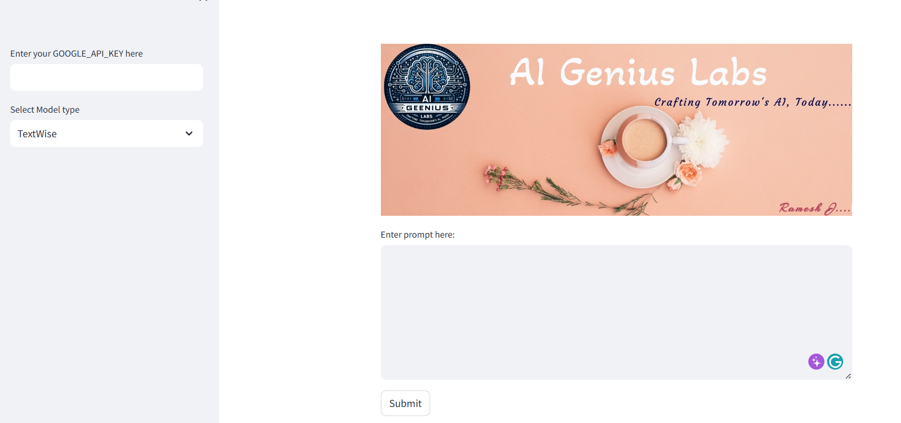
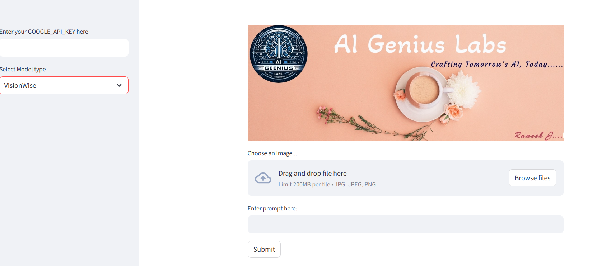

# Streamlit Generative AI App

## Introduction
This Streamlit application integrates Google's generative AI models to provide functionalities for both text and image generation. Users can input text prompts for content generation or upload images to apply image-based generative models. The app also displays a custom banner image at the top.

## Prerequisites
To run this application locally, you will need:
- Python installed on your system.
- Streamlit library.
- Google Generative AI library and a valid Google API key.
- PIL (Python Imaging Library) for image processing.

## Setup
1. **Clone the Repository**
   - Clone this repository to your local machine or download the `app.py` file.

2. **Install Dependencies**
   - Navigate to the directory containing `app.py` and install the required libraries using:
     ```
     pip install streamlit google-generativeai PIL
     ```

3. **Add Your Banner Image**
   - Replace `"C:\\Users\\rames\\OneDrive\\Desktop\\Logo\\Website.jpg"` with the path to your banner image in the `app.py` file.

4. **Google API Key**
   - Obtain a Google API key for using the generative AI models.

## Running the Application
1. **Start Streamlit Server**
   - Open a terminal in the directory containing `app.py`.
   - Run the application using the command:
     ```
     streamlit run app.py
     ```

2. **Accessing the App**
   - The application should now be running on your local server. Usually, it can be accessed at `http://localhost:8501`.

3. **Using the App**
   - Enter your Google API key in the sidebar text input labeled "Enter your GOOGLE_API_KEY here".
   - Choose between 'TextWise' and 'VisionWise' models in the sidebar.
     - For 'TextWise', enter a text prompt and click "Submit" for content generation.
     - 
     - For 'VisionWise', upload an image, enter a prompt, and click "Submit" to see generated results.
     -  

## License
MIT

## Contributors
Ramesh J
